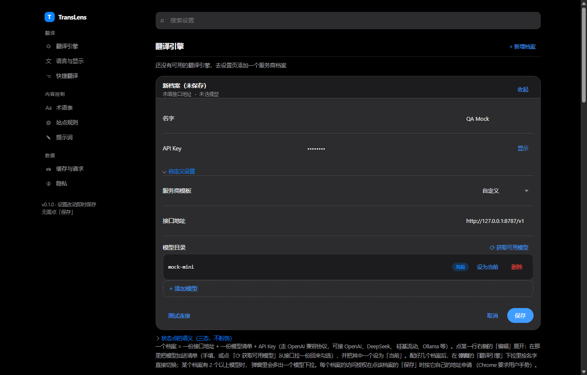

# TransLens


**沉浸式网页翻译扩展**（Manifest V3，Chrome / Edge）：默认**只显示译文**，原文留在 DOM 里随时一键还原，
也可以在弹窗里切成双语对照。

[](https://github.com/noxiayutia/translens/actions/workflows/ci.yml)
[](LICENSE)


> 未上架 Chrome 应用商店（当前 `0.1.0`）：可以直接下载 [Releases](https://github.com/noxiayutia/translens/releases/latest)
> 里的 zip，也可以自己构建。扩展**不预置任何翻译引擎**，译文来自你自己的接口——配一个就能跑，见下面的「配置引擎」。

## 能做什么

| | |
| --- | --- |
| **仅译文 / 双语对照** | 默认把页面换成译文，原文不删，`Alt+T` 还原 |
| **增量翻译** | SPA、无限滚动、下拉菜单里新出现的内容单独翻译，不重发已翻过的段落 |
| **悬停 / 划词** | `Shift` + 悬停出段落译文；选中一句话先出一颗小圆点，停一下才翻 |
| **诊断模式** | `Alt+Shift` + 点击任意段落，直接说清这段「为什么没被翻译」 |
| **多服务商档案** | 接口地址 + 模型清单 + Key，走 OpenAI 兼容协议（DeepSeek / OpenAI / 硅基流动 / 本机 Ollama…） |
| **术语表 · 站点规则 · 提示词** | 强制译名、指定站点永不翻译、改写给模型的系统提示词 |
| **限流自适应** | 撞到 429 自动降并发 + 退避，并在这一轮末尾把被挤掉的段落补译一次 |
| **隐私** | API Key 只在本机 `chrome.storage.local`，不进界面 DOM、不进内容脚本 |

## 安装

**方式一：用现成的包**（不需要 Node）——到 [Releases](https://github.com/noxiayutia/translens/releases/latest)
下载 `translens-0.1.0.zip` 解压，按下面的步骤选中**解压出来的那个文件夹**。

**方式二：自己构建**——需要 **Node.js 22.22.2+ / 24.15+**（`vitest` 与 `jsdom` 的硬要求，Node 20 跑不起来）。

```bash
npm install
npm run build     # 类型检查 → 打包 → 校验产物
```

**加载**：`chrome://extensions` → 打开**开发者模式** → **加载已解压的扩展程序** →
方式一选解压出来的文件夹，方式二选本仓库的 **`dist`** 目录（注意不是仓库根目录）。

## 配置引擎（装完必做）

点弹窗右上角**齿轮**进设置页 →「翻译引擎」→「+ 新增档案」：

1. 选「服务商模板」（OpenAI / DeepSeek / Ollama（本机））或直接手填**接口地址**；
2. 填 **API Key**（接本机 Ollama 时随手填个占位值即可）；
3. 在「模型目录」里加一个模型并设为「当前」；
4. 点 **「保存」**，并在浏览器弹出授权框时**允许**访问该地址——不授权请求会被拦下。

回到弹窗选中这个档案，按 `Alt+T` 或点「翻译此页」即可。



> 图取自本仓的 QA 台架，所以地址是本机假引擎、档案名是 `QA Mock`；真实使用换成你自己的服务商。

## 常用操作

| 操作 | 效果 |
| --- | --- |
| `Alt+T` | 翻译当前页面；再按一次完全还原 |
| 工具栏图标 | 弹窗：翻译此页、显示模式、悬停 / 划词开关、目标语言、切换引擎 |
| `Shift` + 悬停段落 | 气泡里显示该段译文 |
| 划词 | 先出一颗小圆点（这一步零请求），指针动一下或点它才翻译 |
| `Alt+Shift` + 点击段落 | 诊断模式：这段为什么没被翻译 |
| 右键菜单 | 翻译此页 / 翻译选中文本 |

## 已知限制（挑要紧的）

- 几百段的大页面在真实模型下是**分钟级**，期间大片显示「翻译中…」，这是预期行为，不是卡死。
- **切到后台的标签页会明显变慢**（Chrome 会把定时器节流到每分钟一次）——翻译时保持页面可见。
- 「仅译文」模式下整页翻译进行中时，悬停暂时不可用。
- 「仅译文」模式下多链接段落里的链接点不了（要点击请还原或切双语）。

完整清单与每一条的实测读数：[`docs/manual.md`](docs/manual.md)

## 文档

- [`docs/manual.md`](docs/manual.md) — 完整说明：功能细节、实现、**全部已知限制**
- [`docs/qa/`](docs/qa/) — 真机实测报告（代码里那些常数的依据）。写台架脚本前先看 [`measurement-traps`](docs/qa/2026-09-24-measurement-traps.md)：十一个「会骗读数」的坑
- [`docs/superpowers/specs/`](docs/superpowers/specs/) — 逐项设计规格，每份都带一节「未核实的清单」

## 参与

提 issue / PR 前请先读 [`CONTRIBUTING.md`](CONTRIBUTING.md)：这个仓对断言的纪律比一般项目严一点
——每条断言都要能回答「删掉哪一行实现会让它红」。

## 许可

[MIT](LICENSE) © 2026 noxiayutia · 仓库里不包含任何翻译服务，译文都来自你自己配置的接口。
